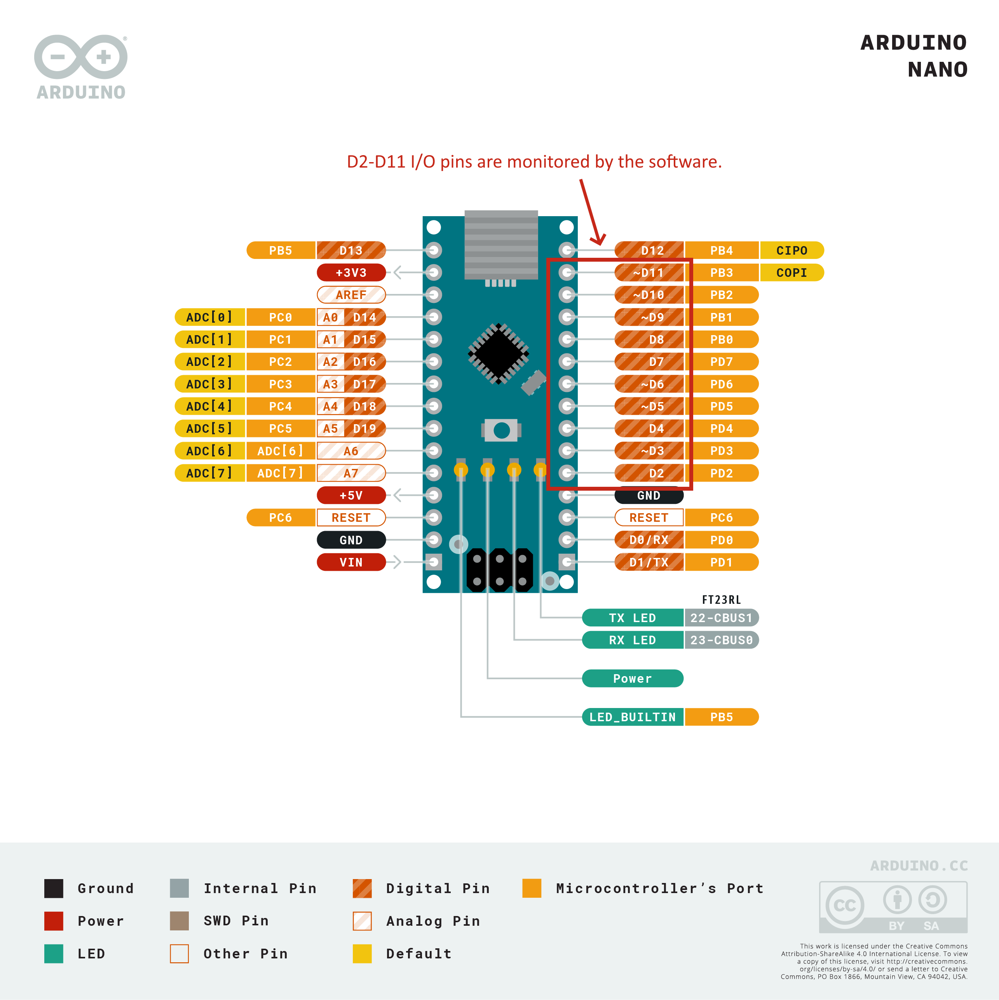
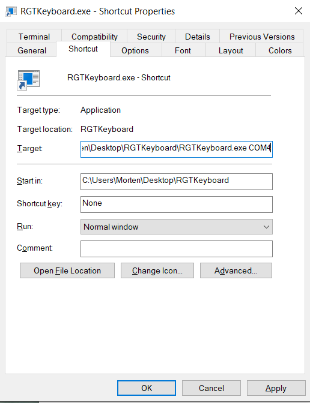
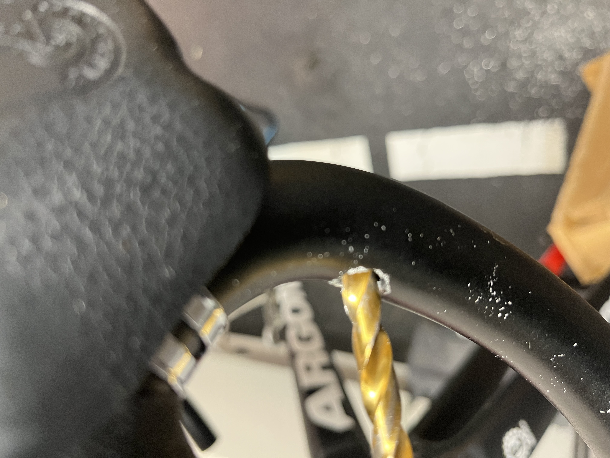
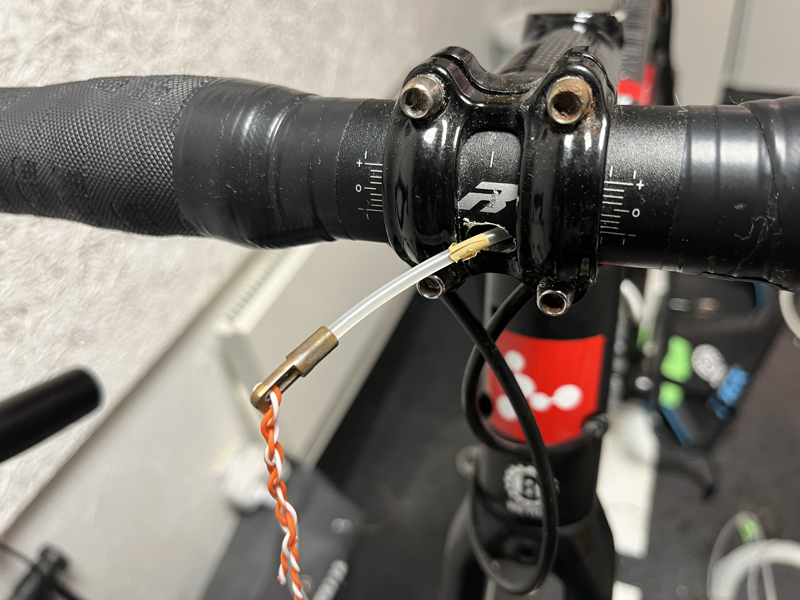
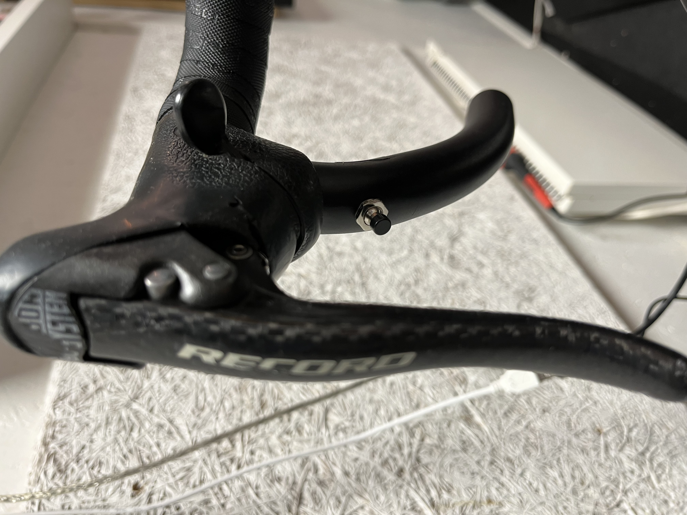
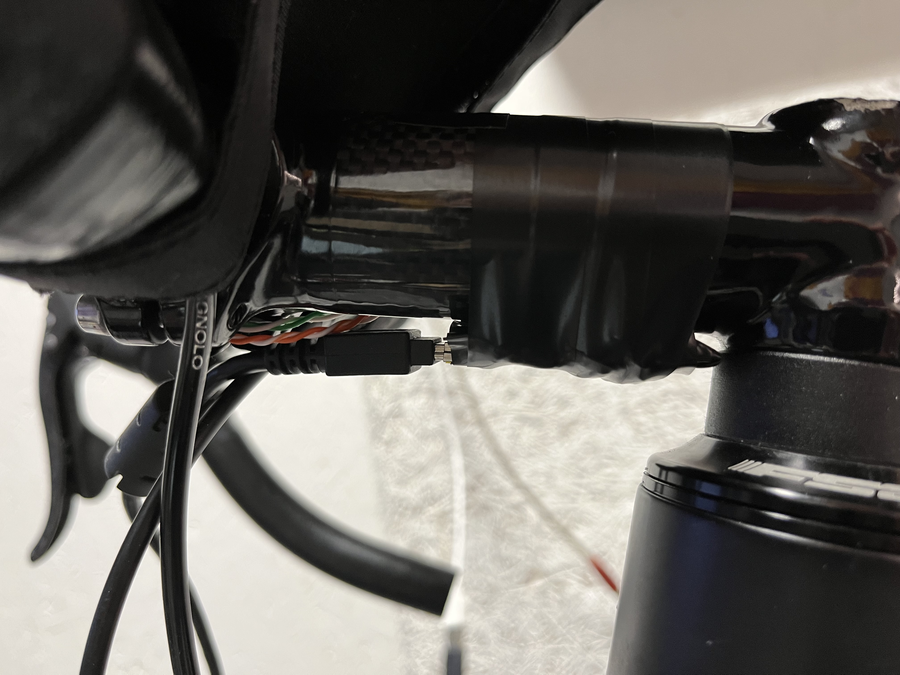

# RGT Steering solution

This is my bid on a cheap and simple solution for giving key inputs to Wahoo RGT Cycling app on PC.

The principles of the solution is as follows:

- A pushbutton where one pin is connected to ground(GND), and the other end connected to a digital I/O pin(D2-D11) of an Arduino microcontroller. When the button is pushed, it connects the pin to GND thus pulling that pin low.
- The software running on the Arduino scans every 200ms for pins pulled low and reports that over its serial port.
- The Arduino is connected to the PC running RGT app via USB. 
- A program listens on the serial port, and performs keyboard inputs based on which pin is activated.

### Parts list

The solution is quite simple, - here is the parts I have used:
- [Arduino Nano](https://www.google.com/search?q=arduino+nano&tbm=shop) microcontroller. Other models can be used too. 
- [Momentary Button](https://www.google.com/search?q=momentary+button+panel+mount&tbm=shop). Any button that releases itself can be used.
- [USB A - Mini cable](https://www.google.com/search?q=usb+mini+cable&tbm=shop). Depeding on the USB port on your Arduino. On my Nanos it is Mini.
- Wire - I used wires from a network cable, as that was what I had.
- [Electrical tape](https://www.google.com/search?q=electrical+tape&tbm=shop)
  
### And the tools:
- Solder iron and tin
- Wirestripper - or just a knife
- Cable pulling spring - to pull the wires thru the handlebar
- A 10mm drill for steel - for the hole at the back of the handlebar(that was the minumum size to insert the buttons)
- A 7mm drill for steel - for the hold to mount the buttons to.

## Arduino part

I have used an Arduino Nano, but any Arduino can be used.

To program the Arduino you need the [Arduino IDE](https://www.arduino.cc/en/software). Open the [ReportPins.ino sketch file](Arduino/ReportPins.ino) from within the Arduino IDE, and upload it to your Arduino board. For how to do this see [Arduino docs](https://docs.arduino.cc/software/ide-v2/tutorials/getting-started/ide-v2-uploading-a-sketch)

After programming remove power, then solder/connect wires and buttons to I/O pins.

## PC part

On your PC [download the program](https://www.dropbox.com/s/kbdzhq5hf4goazb/RGTKeyboard.zip?dl=0) receiving button activations from your Arduino(You can also clone this project and compile it yourself if you have the skills).

Unzip the files to your harddrive, and edit the Commands.txt to accomodate your button setup, or to see which I/O pins to connect to get the desired keyboard input. By default I/O pins are mapped to the following keys:

- D2 = a (Steer left)
- D3 = d (Steer right)
- D4 = p (Push to talk)
- D5 = l (Look behind)

Either just launch the RGTKeyboard.exe and select COM port(You have to try one at a time to find the right one), or from a CMD prompt type RGTKeyboard COM4 for start on a specific COM port. I recommend you right click the .exe in Explorer and "Create shortcut", then edit shortcut and insert desired COM port and then use the shortcut every time you need the application:

To exit the application either close the console window or press enter in it.

## Bike part

Use the buttons you have access to and gives you the right feel. Place them where they are easy accessible. I started out with membrane buttons but found them too hard to locate with your fingers, so I have now changed to push buttons installed in to the handlebar below the hoods:

*I drilled a 10 mm hole on the backside, and a 7 mm hole on the front side to mount the push button into.*

*Intenal cable routing is modern, so with a cable pulling spring I routed the wires thru the handlebar.*

*The right pushbutton is mounted under the right hood, so I can reach the button from multiple positions.*

*The Arduino Nano microcontroller is hidden under the stem so it is protected agains sweat, and the result is a nice stealth setup.*

